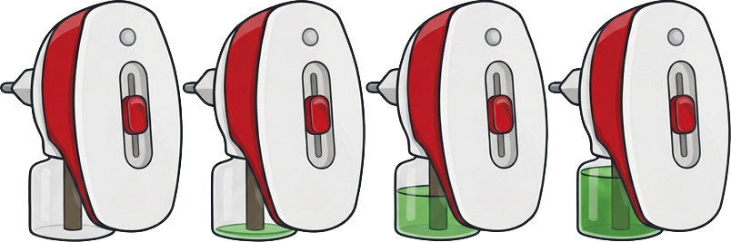

# Insect Trap Card

Lovelace card for the [Insect Traps](https://github.com/domotk/insect-trap)
integration. It draws the appliance itself, with its bottle at the level the
refill is really at and its indicator lit in the colour of the mode.

Press the appliance to switch the trap on or off. Press the lower band to open
its history. The button on the coloured band registers a new refill.



## Install

**HACS** → Frontend → ⋮ → Custom repositories → add this repository as
*Dashboard*. Then install, and add the card to a dashboard:

```yaml
type: custom:insect-trap-card
entity: sensor.my_trap_life_left
```

The entity picker only offers sensors that can actually be drawn — the ones
carrying a refill. The integration gives every trap six sensors and only one of
them is the right one.

## Options

| Option | Default | What it does |
|---|---|---|
| `entity` | — | The trap's **Life left** sensor |
| `show_name` | `true` | Hide the name when the room heading already says it |
| `name` | — | Show this instead of the entity's own name |
| `time_unit` | `auto` | `nights`, `hours`, or `auto` — nights when the integration can work them out |
| `buy_url` | — | Adds a shopping button to the coloured band |

## What it shows

The upper band takes the brand's own colour from the catalogue, and the name sits
in it over up to two lines. The lower band carries what is left, the percentage,
the mode, and a coloured dot when the refill is running low or spent — plus the
date it runs out, once there is enough history to estimate one.

The indicator follows the manufacturer's convention: amber in normal mode, green
in boosted, grey and unlit when the trap is off. Vapour rises from the top only
while it is actually running, because a diffuser that is on should never look
like one that is off.

## The artwork

Each appliance is one PNG: a horizontal strip of frames of the same drawing with
the bottle at different levels. The catalogue says what level each frame depicts,
so the card picks the nearest one and the strip may hold any number of them.

Two details make the strip work:

- **The indicator is drawn grey.** The card lays its own dot over it, so the one
  part that has to change colour is the one part not baked into the image.
- **The frames must be the same drawing**, not four separate renderings. Image
  generators are poor at redrawing one object consistently; the reliable route is
  one frame with the bottle empty, with the levels composited afterwards.

A model with no artwork of its own borrows the catalogue's stand-in. It is the
wrong diffuser, but it still reads as a diffuser.

## Requires

The `insect_trap` integration, and `/local/insect-trap-catalog.json` — which the
integration publishes, and which the card reads for brand colours, refill lists
and artwork. Nothing is drawn until it arrives, so the card never renders twice.

## Built with

Written with [Claude Code](https://claude.com/claude-code). Every push is checked
by the [HACS action](https://github.com/hacs/action). No build step, no bundler:
the card is a plain ES module, served as it is written.

## Licence

MIT.
